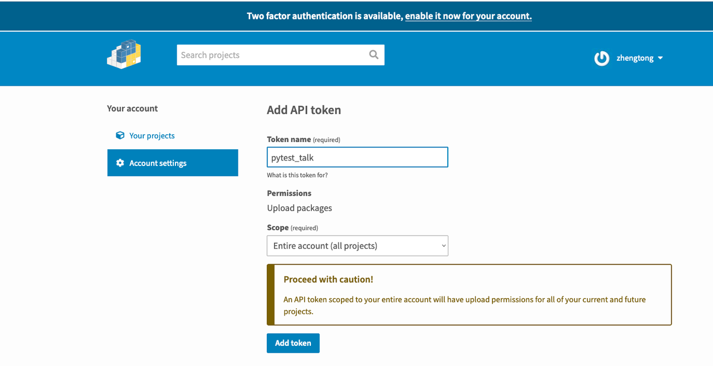

# Pytest 特性介绍  

Pytest是一个`可插拔式(Pluggy是底座)`的自动化测试框架，它通过以下几个方面来对编写测试用例、维护测试用例、扩展测试边界进行了大幅优化(是相比较与Python内置的unittest测试框架)：

&nbsp;  
# 简化编写  

- [支持原生的function级别语法](https://github.com/zhengtong0898/pytest_talk/tree/main/01_function), 不需要继承任何测试框架中的任何对象  
- [支持原生的assert断言语法](https://github.com/zhengtong0898/pytest_talk/tree/main/02_assert), 没有大量的断言语法记忆负担(如: assertGreaterEqual、assertEqual)  
- [支持参数化parameters语法](https://github.com/zhengtong0898/pytest_talk/tree/main/03_parameters), 以参数数据形式驱动测试用例的执行(适用于单接口多参数组合场景)  
- 大幅增强Fixture的能力  
  1). [支持setup、teardown前置和后置特性](https://github.com/zhengtong0898/pytest_talk/tree/main/04_fixtures/setup_teardown)  
  2). 支持不同会话级别的复用   
     - `function:` 每个函数用例都会执行一次Fixture，没有复用特性  
     - `class:` Fixture只会在类中执行一次，类中的其他用例都是复用  
     - `module:` Fixture只会在文件中执行一次，文件中的其他用例都是复用  
     - `package:` Fixture只会在包中执行一次，包中的其他用例都是复用  
     - `session:` 程序的全生命周期中，Fixture只会被执行一次，其他用例都是复用  
  
  3). 支持生产数据、对象特性，例如：创建数据库连接返回实例对象、实例化一个业务对象等等  
  4). 支持混合使用，例如：一个测试用例可以使用多个Fixture，甚至是嵌套Fixture  
- [支持变量的cache能力，使变量能够跨测试用例](https://github.com/zhengtong0898/pytest_talk/tree/main/05_cache) 、跨测试进程(多并发场景)之间进行访问  


&nbsp;  
# 简化维护  

- [支持详细的错误堆栈](https://github.com/zhengtong0898/pytest_talk/tree/main/06_exception), 将错误位置的函数代码的上下文变量全部显示出来
- [支持跳过指定用例](https://github.com/zhengtong0898/pytest_talk/tree/main/07_skip), 当知道某些平台存在限制时不执行该用例  
- [支持标记预期的失败用例](https://github.com/zhengtong0898/pytest_talk/tree/main/08_xfail), 当失败用例是已知bug时，执行该用例期望是失败  
- [支持指定目录执行测试用例](https://github.com/zhengtong0898/pytest_talk/tree/main/09_directory), 把目录当做功能模块来划分测试用例，即可达到按模块跑用例的效果  
- [支持给用例打标签](https://github.com/zhengtong0898/pytest_talk/tree/main/11_marks), 除了按目录之外还支持按标签跑用例  
- [支持失败重跑](https://github.com/zhengtong0898/notebook/blob/main/tester/pytest/docs/re-run_failed_tests.md), 提供丰富的失败重跑策略  
- [支持配置文件管理命令行参数](https://github.com/zhengtong0898/pytest_talk/tree/main/10_config), 简化命令行一大串参数的输入
- 支持命令行执行测试用例，可与 jenkins、github action 等工具集成起来


&nbsp;  
# 扩展测试边界

丰富的生态插件，官网有记录的插件有900+，这里列举几个比较知名的插件:  
- pytest-xdist: 多并发执行测试用例的能力.
- pytest-allure: 生成测试报告的能力.
- pytest-sugar: 测试用例执行过程以进度条形式展示
- pytest-bdd:  按 given、when 、 then 模型来约束测试用例的形态。
- pytest-testinfra: 批量验证环境信息，支持读取ansible inventories hosts、操作k8s、docker等
- pytest-randomly: 打乱测试用例的执行顺序
- pytest-order: 指定测试用例的执行顺序
- pytest-rerunfailures: 用例失败后重跑


&nbsp;  
# 特性比较  
这里列出python内置的UnitTest框架和Pytest框架的基础特性进行比较。  

|特性|辅助描述|UnitTest|Pytest|
|---|---|---|---|
|命令行工具|CLI (Command-Line Interface)|√|√|
|配置文件管理命令行参数|config.ini|<span style="color:red">✕</span>|√|
|按指定目录发现测试用例|-|√|√|
|按标签发现测试用例|-|<span style="color:red">✕</span>|√|
|错误堆栈上下文展示|-|√|√|
|执行测试用例|-|√|√|
|跳过用例|skip、skipIf|√|√|
|标记预期失败用例|xfail、fail|√|√|
|参数化|parameters|<span style="color:red">✕</span>|√|
|重跑失败用例|last-failed: 仅重跑失败用例, 不跑那些已经成功的用例.<br />failed-first: 先跑失败用例, 再跑剩下的其他用例. <br />x: 当出现失败用例时, 不再执行后续用例<br />stepwise: 仅重跑失败用例和后续的未执行用例|<span style="color:red">✕</span>|√|
|函数级别的setup、teardown|fixture function|<span style="color:red">✕</span>|√|
|方法用例级别的setup、teardown|fixture method|√|√|
|类用例级别的setup、teardown|fixture class|√|√|
|文件级别的setup、teardown|fixture module|√|√|
|包级别的setup、teardown|fixture package|<span style="color:red">✕</span>|√|
|全生命周期级别的setup、teardown|fixture session|<span style="color:red">✕</span>|√|
|插件式开发|pluggy|<span style="color:red">✕</span>|√|

从功能特性的比较列表中能看得出来，Pytest的功能集合是完全覆盖掉UnitTest的。  


&nbsp;  
# Pytest为什么要重复造轮子?  

UnitTest是一个纯面向对象风格的自动化测试框架，它要求写用例也是要先采用一个类对象来继承TestCase类，才能在执行的发现阶段被视为是一个测试用例；如果想要给这个框架增加符合特定场景的功能，你需要先对框架中的各个类之间的协作要摸清楚才能开刀，并且大体上只有两种路径，第一种是通过利用面向对象三板斧继承、多态、封装来完成二次开发，第二种是利用编程语言的特性（例如：monkey_patch、mock、hot patch）做一些方法覆盖，这两种方式可以解决很多常见的编程问题，这两种编程方式都属于一体化开发模式，总的来这就需要非常考研你的功底以及交接成本也很高。

反观Pytest是基于可插拔式(Pluggy是底座)的自动化测试框架，从它的第一行代码开始就是围绕着插件、接口声明、接口实现来展开的，它为程序的全生命周期，从加载命令行参数、加载配置文件、启动会话、加载插件、收集测试用例、生成测试用例、加载Fixtures、加载测试用例、执行Fixture、执行测试用例、生成测试报告、缓存执行结果、结束程序，在每个关键位置都预留了hook，这些hook允许开发者对测试行为做出自定义的改变，正是因为这些hook的预留，才让它拥有了如此丰富的生态。


&nbsp;  
# 开发一个插件我们需要掌握哪些概念?  
1. 如何将一段代码打包成库  
   1). 在项目代码的根目录创建一个 pyproject.toml 配置文件.  
         &nbsp; &nbsp; &nbsp; pyproject.toml 是Python的构建系统指定的文件格式，也是说Python指明了就要这个文件。  
         &nbsp; &nbsp; &nbsp; pyproject.toml 配置文件中要声明构建系统版型：hatchling、setuptools(选它)、flit、pdm。    
         &nbsp; &nbsp; &nbsp; pyproject.toml 配置文件中还要声明一些元数据信息: 包名、版本、作者、依赖、项目路径等。  
         &nbsp; &nbsp; &nbsp; pyproject.toml 配置文件中最重要的是: 指定代码路径； 一份完整的配置文件长这样子。  
   ```shell 
   [build-system]
   requires = ["setuptools>=61.0"]
   build-backend = "setuptools.build_meta"
    
   [project]
   name = "project_name"
   version = "0.0.1"
   authors = [ { name="xx", email="xx@xx.com" } ]
   description = "description"
   readme = "README.md"
   license = { file="LICENSE" }
   requires-python = ">=3.6"
   classifiers = [
       "Programming Language :: Python :: 3",
       "License :: OSI Approved :: MIT License",
       "Operating System :: OS Independent",
   ]
    
   [project.urls]
   "Homepage" = "https://github.com/user/project_name"
    
   [tool.setuptools]
   packages = ["source code path"]
   ```
   2). 创建一个简单的项目  
   3). 环境准备和打包  
   ```shell
   # 环境准备
   python3 -m venv venv
   source venv/bin/activate
   pip3 install --upgrade pip
   pip3 install --upgrade build
    
   # 打包
   python3 -m build    
   ```
   4). 打包原理  
   在打包时Python读取pyproject.toml配置文件中的package参数将代码打包到tar.gz和wheel包里，  
   在安装时将代码的完整目录结构放置到 Python/site-packages/ 目录下，  
   在代码导入包时，会到site-packages目录下去加载对应的包。  


2. Pytest的插件注册机制  
Pytest借助setuptools库的能力去遍历读取Python/site-packages目录下的所有包，读的是每个包的元数据信息，当元数据信息中的包含 entry_points 配置，且key名为pytest11时，就会把它当做是一个pytest插件去加载它(术语：注册)。
除了entry_points 的 key 名要定义为 pytest11 之外，value 的值要指定一个加载入口，该入口必须是pytest能够识别的hook，否则插件是无法正常被执行无法正常工作。  
   ```shell
   [project.entry-points."pytest11"]            # "pytest11" 是 key
   project_name = "path.plugin"                 # 这里指定加载hook的代码文件位置    
   ```


3. Pytest提供了什么Hook接口  

   <div style="text-align: center">Pytest全生命周期预留的全量Hooks图</div>  

   <div style="text-align: center">https://docs.pytest.org/en/7.1.x/reference/reference.html#hooks</div>   

      


4. 针对Hook接口做符合需求的实现
5. 如何将打好包的插件上传到官方组件库  
   1). 注册一个账号   
       https://pypi.org/  
   2). 创建一个token  
       
   3). 上传包到组件库  
   ```shell   
   source venv/bin/activate
   pip3 install --upgrade twine
    
   # 免登陆: 创建token文件
   touch ~/.pypirc
   [testpypi]
     username = __token__                                # 固定写死
     password = pypi-ABCDEFGC5weXBpLm9yZwIkOGU0NmYwN2    # token串码
     
   # 上传文件
   python3 -m twine upload --repository pypi dist/*   
   ```


&nbsp;  
# 开发一个插件  

这里提供了一个demo:   
https://github.com/zhengtong0898/pytest-requestselapsed    


